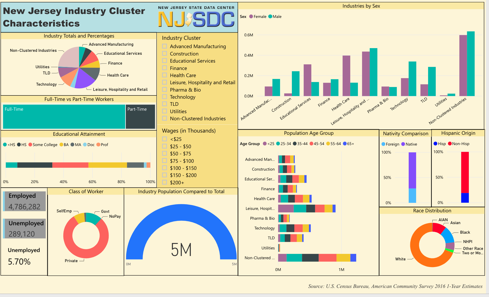
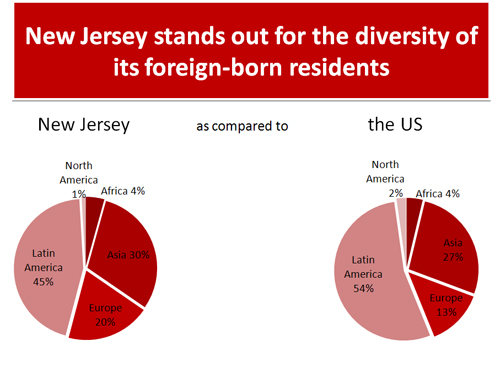
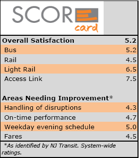

# The Lovely Garden State: Interactive Web Dashboard

## Summary

We have created a map with an interactive dashboard for families looking to move to or within NJ that provides the user important information about a county that is easy to understand. The information includes school performance information, hospital rankings, and income information.

## Group Members

* Arjun Subramaniam
* Smita Sharma
* Mike Lygas
* Gretel Uptegrove

## Motivation

A friend is looking for a place to live in New Jersey and was overwhelmed with the decision-making process. We developed a tool that provides comparison location by county for select information important for families. This tool would narrow down the area to further explore by county.

## Sources

* Hospital Rating Data from [Medicare](https://data.medicare.gov/Hospital-Compare/Hospital-General-Information/xubh-q36u)
  * Includes a list of all hospitals that have been registered with Medicare
  * Utilized hospital ratings from this dataset.
  <!-- INSERT WHAT THE RATINGS MEAN AND WHAT THEY ARE BASED ON -->
  <!-- https://data.medicare.gov/Hospital-Compare/Hospital-General-Information/xubh-q36u -->

* New Jersey School Performance Reports from [New Jersey Department of Education](https://rc.doe.state.nj.us/ReportsDatabase.aspx)
  * Performance data for schools administered by NJ Department of Education.
  * Utilized SAT scores for 2017-2018 school year from this dataset.

* New Jersey Data for Counties [State of New Jersey - GIS Open Data](https://njogis-newjersey.opendata.arcgis.com/datasets/new-jersey-counties)
  * Spatial representation of counties in New Jersey developed by the New Jersey Office of Information Technology and Office of Geographic Information Systems.
  * Utilized geoJson file from database.

<!-- INSERT INFORMATION ABOUT ZIP CODE DATA -->
<!-- INSERT INFORMAITON ABOUT INCOME DATA -->
<!-- INSERT INFORMATION ABOUT SCHOOL GEOJSON DATA -->
<!-- https://factfinder.census.gov/faces/nav/jsf/pages/index.xhtml -->

## Visualization Examples for Inspiration

## Workflow

### Step 1: Extract Data

* Downloaded data as csv or excel files from Medicare, NJ Department of Education, and from the Census Bureau.
* Downloaded geoJson datasets from State of New Jersey - GIS Open Data.

### Step 2: Clean Data

* Developed cleaning code for csv and excel files utilizing jupyter notebook and then exported into python files.
  <!-- Should we go into detail here about data we dropped? -->
* Developed python code for extracting desired data from geoJson dataset for New Jersey schools.
* Converted separate files into functions in python program clean.py that cleans the data and enters them into a SQL database.
* Developed primary python file app.py that calls functions from clean.py and sets up Flask routes for rendering data

<!-- Not sure if schema should be here or elsewhere -->

### Step 3: Render Data

* HTML & CSS Files
  * index.html: Used to setup the webpage where data will be rendered
  * style.css: css file used to style the webpage 

* Javascript Files:
  * logic.js: File that extracts geojson data and maps it; also integrates data from the other sources and maps them as well.
  * config.js: stores the API key
  * jQuery-3.4.1.mn.js: used to render the animated bar chart and for the NJ map interactions
    https://www.jqueryscript.net/chart-graph/bar-column-chart-d3.html Gretel
  * Visual.js: is used to create our plots and display on the webpage 

  Javascript Packages used:
    * Mapbox
    * Leaflet
    * d3
    * jQuery
    * Plotly

## System Requirements

* Chrome Web Browser
* Python environment running Python 3.7

## Steps to run the application

1. Run: `pip install -r requirements.txt` to install necessary modules in environment.
2. Run SQL Database Server on local computer.
3. An API key for MapBox is required. These can be obtained at <https://docs.mapbox.com/help/glossary/access-token/>. After obtaining a key, copy that key into the config.js file.
4. Run `app.py`.
5. Access application at <http://localhost:8000/>.

## How to use the application

